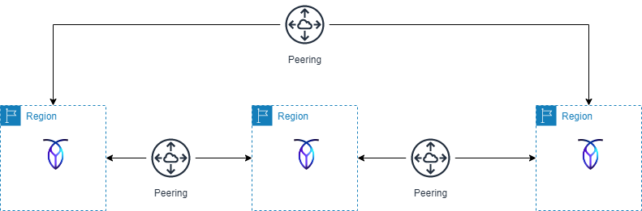
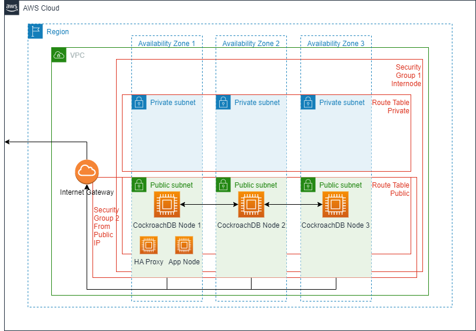

# AWS-Terraform-CRDB-Multi-Region
Create a 3 Region CockroachDB Cluster

## Resources Created
The Terraform Module creates the following infrastructure:
* VPC in each region
* Internet Gateway in each region
* 6 Subnets / 3 Private and 3 Public in each VPC.  3 AZs are used per region: 1 public and 1 private subnet is assigned to each AZ.  
* 1 Public Route Table and 1 Private Route Table per Region with routes for the Peering Connections in the Route Tables
* 2 Security Groups Per Region:  One for access from an external IP (ports 22, 26257, 8080 and 3389) and one security group for all intra-node communication.  The security groups are applied to all EC2 instances.
* Since the cluster node EC2 instances must be a multiple of 3 the cluster nodes are evenly distributed between the AZs.
* Peering Connections (3) between the 3 Cluster Regions
* EC2 instances for the cockroach cluster in each region spread evenly across 3 AZs, with the database software downloaded and installed.  You can also configure the database to be initialized.
* HA Proxy Node per region, configured with the internal IP addresses of the CockroachDB Cluster Nodes (optional)
* App Server Node per region, configured with a bash function 



  
In addition the following resources are created to support the Cluster:
* TLS Keys (Private and Public) for the Cluster
* Self Signed Cert for the Cluster
* TLS Keys (Private and Public) for the Admin User (admin user is optional)
* Cert Request for Admin User
* Locally Signed Cert for the Admin User

## Terraform Variables  
|Variable|Description|Example|
|--------|-----------|-------|
|my_ip_address|The IP address to use in the security group that allows access to the EC2 instances|123.456.789|
|aws_region_list|A list of 3 regions in which to create the Cockroach Cluster.  Note that the selected regions must have at least 3 AZS (us-west-1 does not qualify)|["us-east-1", "us-west-2", "us-east-2"]|
|vpc_cidr_list|A list of 3 non-overlaping cidrs -- one cidr range will be allocated to each VPC|["192.168.3.0/24", "192.168.4.0/24", "192.168.5.0/24"]|
|aws_instance_keys|A list of 3 AWS Instance Keys, one for each region.  These keys must already exist in the AWS infrastructure.|["mykey-us-east-1-kp01", "mykey-us-west-2-kp01", "mykey-us-east-2-kp01"]|
|owner|Used as a tag value on all reasources created as well as the prefix for the name of some of the resources created.|"smith"|
|project_name|Used as a tag value on all resources created.|"customer XYZ demo"|
|environment|Used as a tag value on all resources created.|"DEMO"
|crdb_version|The cockroach database verison|22.2.5|
|crdb_nodes|The number of CockroachDB EC2 instances per region.  For example a value of 3 will create a 9 node cluster with 3 nodes per region.  This number must be a factor of 3.|3|
|crdb_instance_type|The AWS instance type to use for the Cockroach DB EC2 instances. |"t3a.micro" |
|crdb_root_volume_type|The AWS volumn type.  Valid values are: "gp2" or "gp3" | "gp2"|
|crdb_root_volume_size|The size of the AWS volume assigned to each CockroachDB EC2 instance. Minimum size is 8GB.  The unit measurement is in GB.|8|
|include_ha_proxy|"yes" or "no" to create and configure and HA Proxy instance.|"yes"|
|haproxy_instance_type|The AWS instance type to use for the HA Proxy instance.|"t3a.micro" |
|include_app|"yes" or "no" to create and configure an application instance.|"yes"|
|app_instance_type|The AWS instance type to use for the application instance|"t3a.micro" |
|create_admin_user|"yes" or "no" to create an admin user in CockroachDB.|"yes"|
|admin_user_name|The user name to be created as an admin user in the database.  A cert will be created for this user, no password will be generated.  The application instance will be configured with a bash function "CRDB" that will connect to the database cluster via the HA Proxy instance using certificates."|"bob"

# To use the Terraform Script
1. Create AWS key pairs in each region you intend to use for the CockroachDB cluster.  This Terraform script does not create or manage key pairs.
2. Create an access key ID and secret access key in AWS.  The user associated with the ID/secret must have the priviliges necessary to create VPCs, EC2 instances, etc.
3. run the following in your environment:
```
export TF_VAR_cluster_organization='my-cluster-organization'
export TF_VAR_enterprise_license='my-license key'
export AWS_ACCESS_KEY_ID="my-access-key-id"
export AWS_SECRET_ACCESS_KEY="my-secret-access-key"
```
4. Download the git repo to your environment.  This might look like:
```
git clone https://github.com/nollenr/AWS-Terraform-CRDB-Multi-Region.git
```
5. Modify the file terraform.tfvars to set the [variables](#Terraform-Variables) for your configuration
6. Issue the following:
```
terraform init
terraform plan
terraform apply --auto-approve
```
7. To eliminate all of the recources created by the terraform script issue the following:
```
terraform destroy --auto-approve
```

